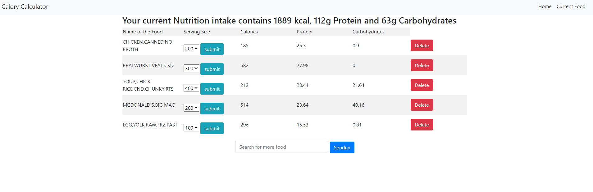

## Calory Calculator using the Food Calorie Data Search API

> Written with Javascript, HTML, CSS, Node.js and Express  
> 
> Item requests should be in english to get corresponding data
> To get an API KEY for this application visit <a> https://rapidapi.com/kenpi04/api/food-calorie-data-search </a>  
> Then go to the env_sample File and change YOUR_API_KEY_HERE to your real API key.
